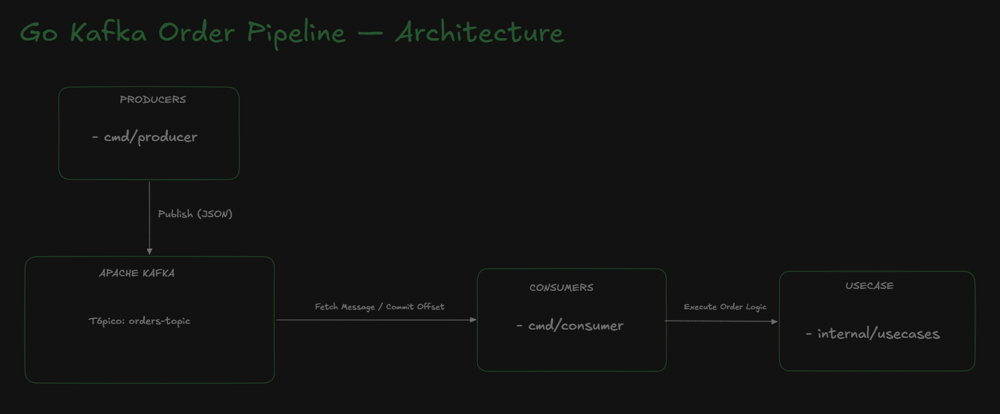
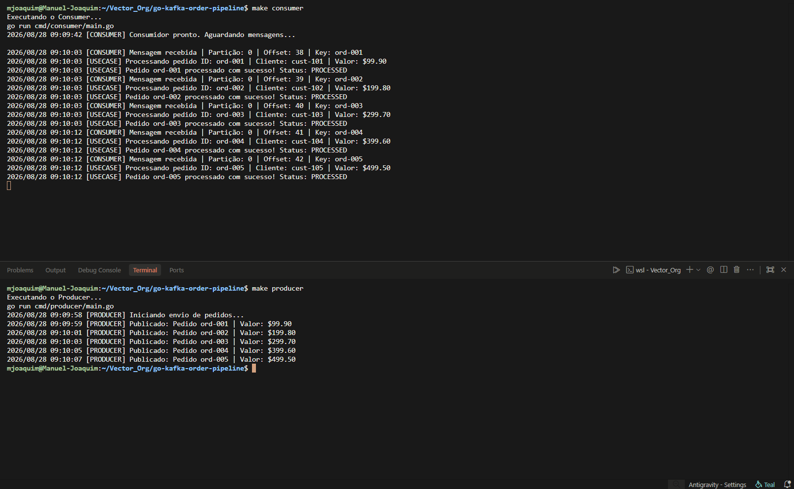

# go-kafka-order-pipeline

Asynchronous order-processing pipeline built in Go, using Apache Kafka for event-driven communication between a producer and a consumer service.

## Overview

This project simulates a real-world e-commerce order flow: a **producer** publishes new orders to a Kafka topic, and a **consumer** independently reads from that topic and processes each order. Producer and consumer are fully decoupled — either can be scaled, restarted, or replaced without affecting the other, which is the core benefit of event-driven architecture over direct service-to-service calls.

**Architecture diagram:**



## Architecture

The project follows a hexagonal-style layout to keep business logic independent of infrastructure:

```
.
├── cmd
│   ├── consumer/main.go     # consumer entrypoint
│   └── producer/main.go     # producer entrypoint
├── internal
│   ├── domain
│   │   └── order.go         # Order entity
│   ├── kafka
│   │   ├── producer.go      # publishes orders to orders-topic
│   │   └── consumer.go      # subscribes to orders-topic
│   └── usecases
│       └── process_order.go # business logic: validate & process an order
├── docker-compose.yml        # local Kafka broker
├── Makefile                  # convenience commands
├── go.mod / go.sum
└── README.md
```

## Features

- Decoupled producer/consumer communicating exclusively through Kafka
- Structured logging with timestamps, partition, and offset for full traceability
- Business logic (order validation and processing) isolated from the Kafka transport layer
- Local Kafka broker via Docker Compose — no external dependencies to run

## Prerequisites

- Go 1.2x+
- Docker and Docker Compose
- `make`

## Getting started

1. **Start Kafka locally**

   ```bash
   make up
   ```

2. **Run the consumer** (in one terminal)

   ```bash
   make consumer
   ```

3. **Run the producer** (in another terminal)

   ```bash
   make producer
   ```

4. **Stop the infrastructure when you're done**

   ```bash
   make down
   ```

The producer will publish a batch of sample orders to `orders-topic`; the consumer will fetch each message, commit the offset, and pass it to the order usecase for processing.

## Available commands

| Command         | Description                                           |
| --------------- | ----------------------------------------------------- |
| `make help`     | Shows all available commands                          |
| `make up`       | Starts Kafka + Zookeeper via Docker Compose           |
| `make down`     | Stops and removes the infrastructure containers       |
| `make restart`  | Restarts the infrastructure (`down` + `up`)           |
| `make status`   | Shows the status of running containers                |
| `make producer` | Runs the producer application                         |
| `make consumer` | Runs the consumer application                         |
| `make build`    | Compiles producer and consumer binaries into `./bin/` |
| `make test`     | Runs the project's unit tests                         |
| `make fmt`      | Formats the Go source code                            |
| `make clean`    | Removes compiled binaries                             |

## Example output

**Producer:**

```
2026/08/28 09:09:58 [PRODUCER] Iniciando envio de pedidos...
2026/08/28 09:09:59 [PRODUCER] Publicado: Pedido ord-001 | Valor: $99.90
2026/08/28 09:10:01 [PRODUCER] Publicado: Pedido ord-002 | Valor: $199.80
2026/08/28 09:10:03 [PRODUCER] Publicado: Pedido ord-003 | Valor: $299.70
```

**Consumer:**

```
2026/08/28 09:09:42 [CONSUMER] Consumidor pronto. Aguardando mensagens...
2026/08/28 09:10:03 [CONSUMER] Mensagem recebida | Partição: 0 | Offset: 38 | Key: ord-001
2026/08/28 09:10:03 [USECASE] Processando pedido ID: ord-001 | Cliente: cust-101 | Valor: $99.90
2026/08/28 09:10:03 [USECASE] Pedido ord-001 processado com sucesso! Status: PROCESSED
```

## Screenshots

<!-- Add screenshots to the `files/` directory at the repo root, then reference them below -->

**Producer and consumer running side by side:**



## Design decisions

- **Why Kafka instead of a direct HTTP call?** Kafka decouples the producer from the consumer in time and availability — the consumer doesn't need to be online when an order is published, and multiple consumers could process the same stream independently (e.g. for analytics, notifications, or fulfillment) without the producer knowing about them.
- **Why separate `usecases` from `kafka`?** The order-processing logic has no dependency on Kafka itself; it could be triggered by an HTTP handler, a cron job, or a different message broker without any change to the business logic.

## Possible next steps

- Add retry logic and a dead-letter topic for orders that fail processing
- Add unit tests for `process_order.go`
- Add consumer group support for horizontal scaling
- Persist processed orders to a database

## License

MIT
